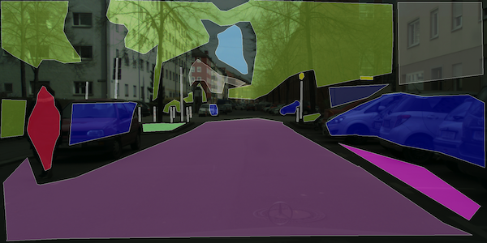
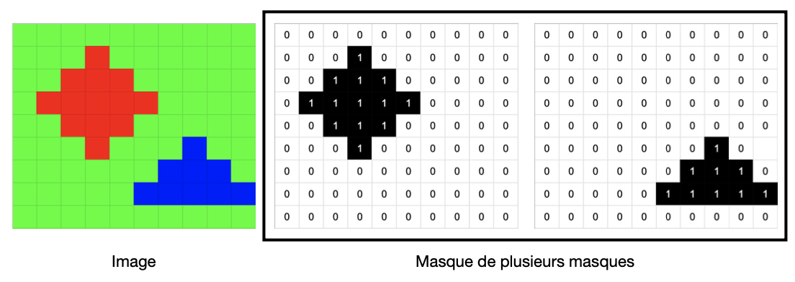
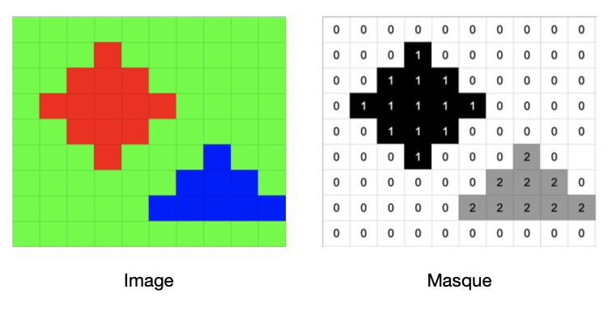
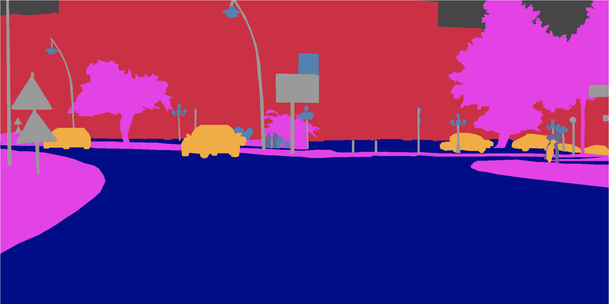
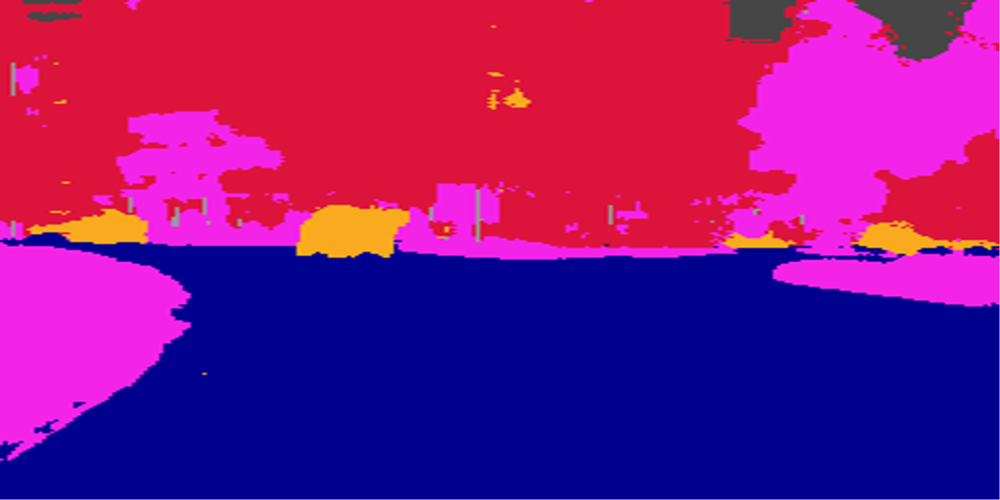
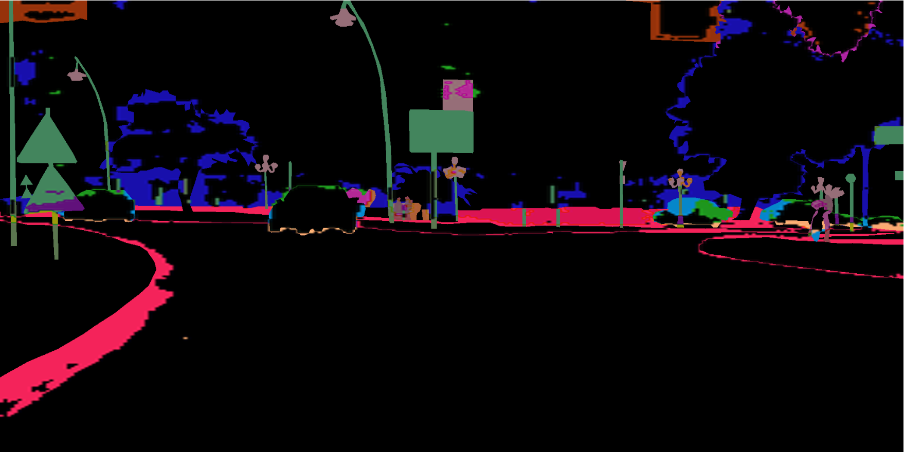
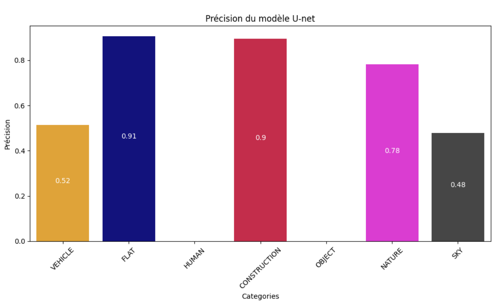

# VisionTransport

[](LICENSE)

Machine learning project for image segmentation integrated into an embedded system for autonomous vehicles. 

## Description  

In the field of computer vision, image segmentation plays a crucial role in
many applications, such as medicine, surveillance, and autonomous driving.
The use of convolutional neural networks (CNN) has proven to be particularly effective in
this task. Among the most efficient architectures, U-Net has emerged as a solution
powerful for semantic segmentation.  

In this project I focused on training a U-net neural network to carry out image segmentation taken from a dashcam camera.  

#### You can download data from [cityscapes-dataset](https://www.cityscapes-dataset.com/).  

Images from on-board cameras in autonomous vehicles provide a feed
continuous visual data, which requires rapid and accurate analysis to enable
transporting the vehicle to its destination. My job here is to carry out the training of the
model in order to provide a response to this data flow and guarantee the safety of the vehicle.  

  

What differentiates my work, is my method of pre-processing the data provided to the neural network. Here I used a LabelEncoder method instead of the One-hot Encoding method.  

#### One-hot Encoding  

  

#### LabelEncoder  

  

This project addresses various interesting topics such as data augmentation with the Albumentation library, the manipulation of metrics and a data processing method created by me. And offers encouraging results for training on a relatively small batch of data.

#### Real Mask  

  

#### Image to segment  

  

#### Predicted Mask  

  

#### Differences  

  

#### Accuracy  



## Table of Contents

- [Getting Started](#Getting-Started)
- [Launch Application](#Launch-Application)
- [Contributing](#Contributing)
- [License](#License)

## Getting Started  

You can use my training model because of Github storage. But if you train your own model you can install and use my repository like this.  

```bash
git clone https://github.com/HaDock404/ai-vision-futur_transport.git
cd ai-vision-futur_transport
pip install -r ./packages/requirements.txt
```

## Launch Application  

You can use my training model because of Github storage. But if you train your own model you can install and use my repository like this.  

```bash
python production/application/main.py
```

## Contributing

Pull requests are welcome. For major changes, please open an issue first
to discuss what you would like to change.

Please make sure to update tests as appropriate.

## License  

This project is licensed under the MIT License - see the [LICENSE](./LICENSE) file for details.